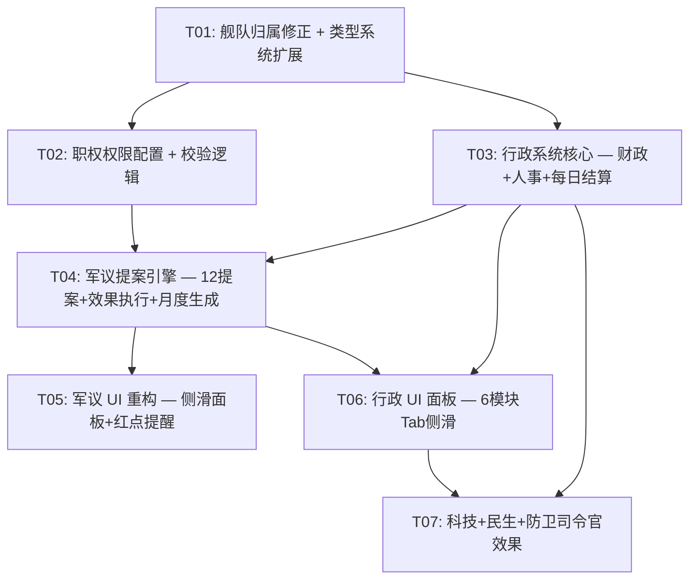

# 系统架构设计：军议重构 + 行政系统 + 职位职权 + 舰队归属修正

> **项目**: 银河英雄传说 策略游戏 (hex-strategy-game)
> **技术栈**: Vue 3 + Phaser + Pinia + TypeScript
> **架构师**: 高见远 (Bob)
> **日期**: 2025-07
> **前置文档**: `PRD_军议重构_行政系统_职位职权_舰队归属.md`

---

## 1. 实现方案概述

### 1.1 总体改造策略

本需求涉及四大改造方向，核心原则是**最小侵入、分层解耦、渐进交付**：

| 方向 | 策略 | 风险等级 |
|------|------|---------|
| 舰队归属修正 | 提取硬编码映射表到独立配置文件，替换 `initFleetAssignment` 内部分割逻辑 | 低 |
| 类型系统扩展 | 在 `types/game.ts` 增量扩展 `ProposalType`（6→12）+ 新增行政状态接口 | 低 |
| 行政系统 | 新建 `adminStore.ts` 独立管理 6 模块状态，避免继续膨胀 `gameStore.ts`（已 2590 行） | 中 |
| 军议非侵入式重构 | 删除 `strategicTick` 中强制暂停逻辑，改为月度自动生成提案 + 侧滑面板主动访问 | 中 |

**架构决策**：
1. **新建 `adminStore.ts`**：gameStore.ts 已 2590 行，行政系统 6 模块的日结算逻辑如果继续堆入会导致维护困难。独立 store 通过 Pinia 跨 store 调用与 gameStore 交互。
2. **新建 `proposalEngine.ts`**：提案效果执行引擎（12 种效果 + 否决后果）提取为纯函数模块，便于测试和扩展。
3. **新建 `roleConfig.ts`**：职权权限配置从 gameStore 内部常量提取为独立配置，12 提案类型权限 + 舰队调动权 + 适配度计算。
4. **新建 `fleetAssignment.ts`**：舰队归属映射表独立配置，与 gameStore 的 `initFleetAssignment` 解耦。
5. **CouncilPanel.vue 原地重构**：不新建 V2 文件，直接改造现有组件（全屏模态 → 侧滑面板），避免组件碎片化。

### 1.2 文件修改范围一览表

| 文件 | 操作 | 改动摘要 |
|------|------|---------|
| `types/game.ts` | [修改] | ProposalType 扩展 6→12；新增 AdminState 等 8 个接口；Proposal 接口扩展 |
| `config/tagConfig.ts` | [修改] | POLITICAL_VOTE_COEFFICIENTS 扩展至 12 提案类型系数 |
| `config/fleetAssignment.ts` | [新建] | 莱因哈特/谬肯贝尔加麾下 admiral ID 映射表 |
| `config/roleConfig.ts` | [新建] | RolePermissions（12类型）+ canCommandFleet + calculateRoleEfficiency |
| `store/adminStore.ts` | [新建] | 行政 6 模块状态 + 每日结算函数（财政/人事/科技/民生） |
| `utils/proposalEngine.ts` | [新建] | executeProposalEffect + executeProposalRejection + generateMonthlyProposals |
| `store/gameStore.ts` | [修改] | initFleetAssignment 重写；strategicTick 改造；submitProposal 集成引擎；新增 councilPendingCount/pendingProposals |
| `store/nodeStore.ts` | [修改] | processDailyEconomy 扩展返回治安/开发度变化 |
| `components/meta/CouncilPanel.vue` | [修改] | 全屏模态 → 侧滑面板；4 提案 → 12 提案；不暂停游戏 |
| `components/meta/AdminPanel.vue` | [新建] | 行政院侧滑面板，6 模块 Tab |
| `components/meta/StrategicScreen.vue` | [修改] | 底部按钮改造为顶部菜单「军议●」+「行政院」按钮 |
| `App.vue` | [修改] | 挂载 AdminPanel 组件 |

---

## 2. 文件列表及相对路径

> 以下路径均相对于 `frontend/src/`

### 2.1 类型与配置层

| # | 文件路径 | 操作 | 改动内容 |
|---|---------|------|---------|
| 1 | `types/game.ts` | [修改] | `ProposalType` 扩展至 12 类型（新增 logistics/tech_mobilize/intel_op/diplomat_op/morale_boost/fortify）；新增 `AdminState`/`FinanceState`/`PersonnelState`/`TechnologyState`/`WelfareState`/`DiplomacyState`/`IntelligenceState`/`AppointmentRecord`/`Treaty`/`TechField`/`IntelLevel` 接口；`Proposal` 接口新增 `rejectionEffect`/`risk`/`requiredRoles`/`gameCoupling`/`targetFactionId`/`generatedDate`/`duration` 字段；`BaseAdmiral` 新增 `loyalty`/`assignedNodeId` 字段 |
| 2 | `config/tagConfig.ts` | [修改] | `POLITICAL_VOTE_COEFFICIENTS` 每个 PoliticalTag 的系数表扩展至 12 提案类型（新增 6 类的系数值）；`ROLE_VOTE_INFLUENCE` 扩展至 12 类型 |
| 3 | `config/fleetAssignment.ts` | [新建] | 导出 `REINHARD_FLEET_COMMANDERS`（Set<number>，9 人）、`MUECKENBERGER_FLEET_COMMANDERS`（Set<number>，8 人）、`ALLIANCE_FLEET_COMMANDERS`（Set<number>，13 人）三个常量；导出 `assignFleetByNovel(admirals, fleets)` 函数 |
| 4 | `config/roleConfig.ts` | [新建] | 导出 `ROLE_PERMISSIONS_V2: Record<NationalRole, ProposalType[]>`（12 类型完整权限矩阵）；导出 `canCommandFleet(admiral, fleet): boolean`；导出 `calculateRoleEfficiency(admiral): number`；导出 `ROLE_FLEET_AUTHORITY: Record<NationalRole, 'all' | 'group' | 'station' | 'self' | 'none'>` |

### 2.2 状态管理层

| # | 文件路径 | 操作 | 改动内容 |
|---|---------|------|---------|
| 5 | `store/adminStore.ts` | [新建] | Pinia store，管理 `adminState: Ref<AdminState>`；每日结算函数 `processDailyFinance()`/`processDailyPersonnel()`/`processDailyTechnology()`/`processDailyWelfare()`；行政操作函数 `setTaxRate()`/`toggleWarTax()`/`appointAdmiral()`/`setResearchFocus()`；初始化函数 `initAdminState(factionId)` |
| 6 | `store/gameStore.ts` | [修改] | ① `initFleetAssignment` 调用 `assignFleetByNovel` 替换内部逻辑；② `strategicTick` L1183-1187 删除 `triggerCouncilMeeting()` 强制暂停，改为调用 `generateMonthlyProposals()`；③ `submitProposal` 通过后调用 `executeProposalEffect`，被否决调用 `executeProposalRejection`；④ 新增 `pendingProposals: Ref<Proposal[]>`、`councilPendingCount: Ref<number>`、`councilHistory: Ref<Proposal[]>`（最近 20 条）；⑤ `evaluateRandomEvents` 扩展为调用 adminStore 的每日结算；⑥ 删除 `triggerCouncilMeeting` 函数 |
| 7 | `store/nodeStore.ts` | [修改] | `processDailyEconomy` 返回值扩展为 `{ alliance, empire, allianceSecurity, empireSecurity, allianceDevelopment, empireDevelopment }`；新增 `processDailyNodeRecovery(factionId)` 处理治安/开发度自然恢复 |

### 2.3 工具层

| # | 文件路径 | 操作 | 改动内容 |
|---|---------|------|---------|
| 8 | `utils/proposalEngine.ts` | [新建] | 导出 `executeProposalEffect(proposal, context): void`（12 种提案效果 switch）；导出 `executeProposalRejection(proposal, context): void`（3 种否决后果 switch）；导出 `generateMonthlyProposals(context): Proposal[]`（月度智能提案生成）；导出 `PROPOSAL_DEFINITIONS: Record<ProposalType, ProposalDef>`（12 条提案完整定义表）；内部辅助函数 `applyFactionBuff`/`applyFactionMoraleBuff`/`applyNodeBuff`/`replenishFleetComposition` 等 |

### 2.4 UI 层

| # | 文件路径 | 操作 | 改动内容 |
|---|---------|------|---------|
| 9 | `components/meta/CouncilPanel.vue` | [修改] | 完全重构：① `position: fixed; right: 0; top: 0; height: 100vh; width: 480px` 侧滑面板替代全屏 overlay；② 删除 `strategicPaused` 联动，不暂停游戏；③ 4 个提案按钮 → 12 个提案卡片，分「待处理」和「历史决议」两组；④ 投票按钮先弹详情确认卡（效果/风险/权限），确认后执行 `submitProposal` + `executeProposalEffect`；⑤ 红点数字由 `councilPendingCount` 驱动 |
| 10 | `components/meta/AdminPanel.vue` | [新建] | 侧滑面板（`width: 520px`），6 模块 Tab 切换（财政/人事/科技/民生/外交/情报）；P0 模块（财政/人事）完整功能；P1 模块（科技/民生）数据显示 + 基础操作；P2 模块（外交/情报）灰色禁用占位；操作按钮受 `ROLE_PERMISSIONS_V2` 约束，无权时 disabled + tooltip「职级不足，无权执行此操作」 |
| 11 | `components/meta/StrategicScreen.vue` | [修改] | 底部 `.bottom-controls` 区域改造：移除「内政提案」和「军议申请」按钮，改为顶部导航栏新增「军议●」（红点）和「行政院」按钮；两个按钮可同时打开各自侧滑面板，不互斥 |
| 12 | `App.vue` | [修改] | 在 `StrategicScreen` 下方挂载 `AdminPanel` 组件；引入 `AdminPanel` 组件声明 |

---

## 3. 数据结构和接口

### 3.1 类型扩展（types/game.ts）

```typescript
// === ProposalType 扩展（6 → 12） ===
export type ProposalType =
  // 原有 6 类
  | 'invasion' | 'defense' | 'budget' | 'personnel' | 'tax' | 'conscription'
  // 新增 6 类
  | 'logistics' | 'tech_mobilize' | 'intel_op' | 'diplomat_op' | 'morale_boost' | 'fortify';

// === Proposal 接口扩展 ===
export interface Proposal {
  id: number;
  proposerId: number;
  factionId: number;
  type: ProposalType;
  targetNodeId?: number;
  targetAdmiralId?: number;
  targetFactionId?: number;       // [新增] 外交施压目标阵营
  budgetAmount?: number;

  supportWeight: number;
  opposeWeight: number;
  status: ProposalStatus;

  createdAt: string;
  generatedDate?: string;          // [新增] 系统自动生成的日期
  resolvedDate?: string;           // [新增] 玩家处理日期
  duration?: number;               // [新增] 效果持续天数
  rejectionEffect?: string;        // [新增] 否决后果描述
  risk?: string;                   // [新增] 风险描述
  requiredRoles?: NationalRole[];  // [新增] 所需职位权限
  gameCoupling?: string;           // [新增] 游戏耦合点说明
}

// === 行政状态接口 ===
export interface AdminState {
  finance: FinanceState;
  personnel: PersonnelState;
  technology: TechnologyState;
  welfare: WelfareState;
  diplomacy: DiplomacyState;
  intelligence: IntelligenceState;
}

export interface FinanceState {
  treasury: number;
  baseTaxRate: number;           // 0.1 ~ 0.3
  warTaxRate: number;            // 0 ~ 0.2
  fleetMaintenanceCost: number;
  monthlyIncome: number;
  monthlyExpense: number;
}

export interface PersonnelState {
  appointments: AppointmentRecord[];
  loyaltyModifiers: Record<number, number>;
}

export interface AppointmentRecord {
  admiralId: number;
  role: NationalRole;
  appointedDate: string;
  efficiency: number;            // 0.5 ~ 1.5
}

export interface TechnologyState {
  weaponLevel: number;
  armorLevel: number;
  engineLevel: number;
  electronicLevel: number;
  researchProgress: Record<TechField, number>;
  researchSpeed: number;
  researchFocus: TechField;
  techMobilizeBuffDays: number;  // 科技动员剩余天数
}

export type TechField = 'weapon' | 'armor' | 'engine' | 'electronic';

export interface WelfareState {
  avgSecurity: number;
  avgDevelopment: number;
  unrestRisk: number;
}

export interface DiplomacyState {
  relations: Record<number, number>;
  treaties: Treaty[];
}

export interface Treaty {
  targetFactionId: number;
  type: 'ceasefire' | 'trade' | 'alliance' | 'war';
  expiryDate: string;
}

export interface IntelligenceState {
  intelLevel: Record<number, IntelLevel>;
  revealedFleets: number[];
  intelOpBuffDays: number;       // 情报行动剩余天数
}

export type IntelLevel = 'none' | 'basic' | 'detailed' | 'full';

// === BaseAdmiral 扩展字段 ===
// 在现有 BaseAdmiral 接口中新增：
//   loyalty: number;              // 忠诚度 0-100
//   assignedNodeId: number | null; // 防卫司令官驻守节点
```

### 3.2 职权配置（config/roleConfig.ts）

```typescript
// 12 提案类型完整权限矩阵
export const ROLE_PERMISSIONS_V2: Record<NationalRole, ProposalType[]> = {
  emperor:               ['invasion','defense','budget','personnel','tax','conscription',
                          'logistics','tech_mobilize','intel_op','diplomat_op','morale_boost','fortify'],
  prime_minister:        ['budget','personnel','tax','logistics','diplomat_op'],
  military_minister:     ['budget','conscription','logistics','tech_mobilize','fortify'],
  high_command_chief:    ['invasion','defense','intel_op'],
  joint_ops_chief:       ['invasion','defense','intel_op'],
  joint_ops_deputy:      ['invasion','morale_boost'],
  space_fleet_commander: ['invasion','morale_boost'],
  space_fleet_deputy:    ['invasion','morale_boost'],
  intel_minister:        ['defense','intel_op','diplomat_op'],
  defense_commander:     ['defense','fortify'],
  fleet_commander:       ['invasion'],
  fleet_staff:           [],
  council:               ['invasion','defense','budget','personnel','tax','conscription',
                          'logistics','tech_mobilize','intel_op','diplomat_op','morale_boost','fortify'],
  none:                  [],
};

// 舰队调动权分类
export const ROLE_FLEET_AUTHORITY: Record<NationalRole, 'all'|'group'|'station'|'self'|'none'> = {
  emperor: 'all', council: 'all',
  high_command_chief: 'all', joint_ops_chief: 'all',
  space_fleet_commander: 'group', space_fleet_deputy: 'group',
  defense_commander: 'station',
  fleet_commander: 'self',
  joint_ops_deputy: 'group',
  military_minister: 'none', intel_minister: 'none',
  prime_minister: 'none', fleet_staff: 'none', none: 'none',
};

// 校验提督是否有权调动/指挥某舰队
export function canCommandFleet(admiral: BaseAdmiral, fleet: StrategicFleet): boolean;

// 职位适配度行政效率
export function calculateRoleEfficiency(admiral: BaseAdmiral): number;
```

### 3.3 舰队归属映射（config/fleetAssignment.ts）

```typescript
// 莱因哈特麾下（改革派）— 9 人
export const REINHARD_FLEET_COMMANDERS = new Set([80, 98, 62, 65, 84, 97, 99, 29, 15]);

// 谬肯贝尔加麾下（传统派）— 8 人
export const MUECKENBERGER_FLEET_COMMANDERS = new Set([0, 36, 37, 44, 71, 85, 89, 90]);

// 同盟舰队司令 — 全部归罗波斯(id:164)
export const ALLIANCE_FLEET_COMMANDERS = new Set([101,103,106,113,114,123,136,145,147,149,156,161,162]);

// 按小说设定分配舰队归属
export function assignFleetByNovel(
  admirals: BaseAdmiral[],
  fleets: StrategicFleet[]
): void;
```

### 3.4 提案定义表（utils/proposalEngine.ts）

```typescript
export interface ProposalDef {
  type: ProposalType;
  name: string;
  description: string;
  effect: string;
  rejectionEffect: string;
  risk: string;
  requiredRoles: NationalRole[];
  cost?: number;             // 国库消耗
  duration?: number;         // 效果持续天数
  requiresTargetNode?: boolean;  // 是否需要选择目标节点
  requiresTargetFaction?: boolean; // 是否需要选择目标阵营
}

export const PROPOSAL_DEFINITIONS: Record<ProposalType, ProposalDef>;
// 12 条提案完整定义，对应 PRD 第 4 节
```

---

## 4. 任务列表

> 按依赖顺序排列，每个任务包含 ID、标题、描述、依赖、涉及文件、复杂度。

### T01: 舰队归属修正 + 类型系统扩展

**描述**：这是基础层任务，为后续所有任务提供类型定义和立即见效的舰队归属修正。分两部分：
1. 创建 `config/fleetAssignment.ts`，包含莱因哈特/谬肯贝尔加/同盟三组 admiral ID 映射表和 `assignFleetByNovel()` 函数。修改 `gameStore.ts` 的 `initFleetAssignment` 调用新函数。
2. 在 `types/game.ts` 扩展 `ProposalType`（6→12），新增行政状态接口（`AdminState` 及 6 个子接口），扩展 `Proposal` 接口。在 `BaseAdmiral` 接口新增 `loyalty` 和 `assignedNodeId` 字段。
3. 在 `config/tagConfig.ts` 扩展 `POLITICAL_VOTE_COEFFICIENTS` 和 `ROLE_VOTE_INFLUENCE` 至 12 提案类型。

**依赖**：无

**涉及文件**：
- `types/game.ts` [修改]
- `config/fleetAssignment.ts` [新建]
- `config/tagConfig.ts` [修改]
- `store/gameStore.ts` [修改 — initFleetAssignment]

**复杂度**：M

**关键实现细节**：
- `assignFleetByNovel` 逻辑：帝国侧先查 `REINHARD_FLEET_COMMANDERS`，再查 `MUECKENBERGER_FLEET_COMMANDERS`，未匹配的按 `fleetNumber` 兜底分割（保留现有 fallback）。同盟侧全部归 `space_fleet_commander`（罗波斯 id:164）。玩家舰队 fleetNumber=0 的 parentCommanderId 设为玩家所属阵营的 space_fleet_commander。
- `POLITICAL_VOTE_COEFFICIENTS` 新增 6 类的系数值参考：`logistics`（改革派+0.2，贵族派-0.1）、`tech_mobilize`（军国派+0.3，和平派-0.2）、`intel_op`（情报重视+0.3，冒险型+0.1）、`diplomat_op`（民主派+0.2，军国派-0.2）、`morale_boost`（全军通用+0.1）、`fortify`（防守反击+0.2，冒险型-0.1）。
- `BaseAdmiral.loyalty` 初始值默认 70，`assignedNodeId` 默认 null。

---

### T02: 职权权限配置 + 校验逻辑

**描述**：将职权从 gameStore 内部常量提取为独立配置，实现 12 提案类型权限矩阵和舰队调动权限校验。
1. 创建 `config/roleConfig.ts`，导出 `ROLE_PERMISSIONS_V2`（14 个职位 × 12 提案类型完整矩阵）、`ROLE_FLEET_AUTHORITY`（舰队调动权分类）、`canCommandFleet(admiral, fleet)` 函数、`calculateRoleEfficiency(admiral)` 函数。
2. 修改 `gameStore.ts` 中的 `submitProposal`，将权限校验从旧 `RolePermissions` 切换到 `ROLE_PERMISSIONS_V2`。权限不足时触发 Toast「职级不足，无权执行此操作」。
3. 修改 `gameStore.ts` 的 `issueWarpOrder` 函数，在执行 Warp 跃迁前调用 `canCommandFleet` 校验。

**依赖**：T01

**涉及文件**：
- `config/roleConfig.ts` [新建]
- `store/gameStore.ts` [修改 — submitProposal, issueWarpOrder]
- `types/game.ts` [修改 — 确认 NationalRole 引用]

**复杂度**：M

**关键实现细节**：
- `canCommandFleet` 逻辑：emperor/council → true；high_command_chief/joint_ops_chief → true；space_fleet_commander/deputy → `fleet.parentCommanderId === admiral.id`；defense_commander → `fleet.currentNodeId === admiral.assignedNodeId`；fleet_commander → `fleet.commanderId === admiral.id`；其余 → false。
- `calculateRoleEfficiency` 逻辑：基于 `ROLE_FITNESS_MAP`（已存在于 tagConfig.ts），匹配 → 1.3，不匹配 → 0.7，无适配标签 → 1.0。
- 叛变舰队 `parentCommanderId` 设为 null（按决策 5）。

---

### T03: 行政系统核心 — 财政 + 人事 + 每日结算

**描述**：创建独立的 adminStore 管理行政 6 模块状态，实现财政和人事两个 P0 模块的每日结算逻辑。
1. 创建 `store/adminStore.ts`，定义 `adminState: Ref<AdminState>` 初始状态。实现 `initAdminState(factionId)` 初始化函数。
2. 实现 `processDailyFinance()`：基础税收 + 战争附加税 + 舰队维护费计算 + 国库赤字处理（士气/补给下降）+ 战争税治安惩罚。
3. 实现 `processDailyPersonnel()`：忠诚度自然衰减（-0.5/日）+ 标签修正（righteous +0.3，opportunist -0.2）+ 叛变检测（ambition_faction 且 loyalty<30）+ 职位适配度更新。
4. 实现 `processDailyWelfare()`：治安度/开发度自然恢复（防卫司令官辖区 +3x）+ 暴动风险计算。
5. 修改 `gameStore.ts` 的 `strategicTick`，在 `evaluateRandomEvents` 处改为调用 adminStore 的每日结算函数。
6. 修改 `nodeStore.ts` 的 `processDailyEconomy`，扩展返回值包含治安/开发度变化。

**依赖**：T01

**涉及文件**：
- `store/adminStore.ts` [新建]
- `store/gameStore.ts` [修改 — strategicTick, evaluateRandomEvents]
- `store/nodeStore.ts` [修改 — processDailyEconomy]
- `types/game.ts` [修改 — 确认 AdminState 接口引用]

**复杂度**：XL

**关键实现细节**：
- `processDailyFinance` 伪代码见 PRD 5.2 节。维护费公式：`(battleships×2 + cruisers×1 + destroyers×0.5) × 0.1`。
- `processDailyPersonnel` 伪代码见 PRD 5.3 节。叛变检测：`ambition_faction` 标签且 loyalty<30 时触发 `triggerMutinyEvent`，叛变舰队 factionId 变更为敌方，parentCommanderId 设为 null。
- adminStore 通过 `useGameStore()` 获取 strategicFleets、metaGold 等数据（Pinia 跨 store 调用）。
- `initAdminState` 在 `initStrategicMap` 中调用，初始化基础税率 0.2、战争税 0、科技等级全 1、研发速度 2.0/日。

---

### T04: 军议提案引擎 — 12 提案 + 效果执行 + 月度生成

**描述**：实现提案效果执行引擎和月度自动提案生成，完成军议系统的核心逻辑层。
1. 创建 `utils/proposalEngine.ts`，导出 `PROPOSAL_DEFINITIONS`（12 条提案完整定义表）、`executeProposalEffect(proposal, context)`、`executeProposalRejection(proposal, context)`、`generateMonthlyProposals(context)`。
2. `executeProposalEffect` 实现 12 种提案通过后的效果执行（Warp 速度 buff、士气修正、国库增减、舰队补充、科技 buff、情报提升、要塞强化等），使用内部辅助函数 `applyFactionBuff`/`applyFactionMoraleBuff`/`applyNodeBuff`/`replenishFleetComposition` 等。
3. `executeProposalRejection` 实现 3 种否决后果（budget → 维护费强制扣减 + 士气下降；morale_boost → 军心涣散事件；conscription → 无直接后果）。其余提案否决无惩罚（按决策 3）。
4. `generateMonthlyProposals` 根据当前战略局势（战时/国库/士气/补给线）智能选择 3-5 条提案，推入 `pendingProposals`。
5. 修改 `gameStore.ts`：`submitProposal` 通过后调用 `executeProposalEffect`，被否决调用 `executeProposalRejection`；`strategicTick` 中每月 1 号调用 `generateMonthlyProposals` 替代 `triggerCouncilMeeting`；删除 `triggerCouncilMeeting` 函数。
6. 新增 `councilPendingCount: Ref<number>` 和 `councilHistory: Ref<Proposal[]>`（保留最近 20 条）。

**依赖**：T01, T02, T03

**涉及文件**：
- `utils/proposalEngine.ts` [新建]
- `store/gameStore.ts` [修改 — submitProposal, strategicTick, 删除 triggerCouncilMeeting, 新增 pendingProposals/councilPendingCount/councilHistory]
- `types/game.ts` [修改 — Proposal 接口确认]

**复杂度**：XL

**关键实现细节**：
- `executeProposalEffect` 的 context 参数需包含 `{ playerFactionId, metaGold, tacticalMerit, strategicFleets, strategicNodes, adminStore }`，通过传入引用避免循环依赖。
- `generateMonthlyProposals` 逻辑见 PRD 附录 B。`analyzeStrategicContext` 需读取当前是否战时（是否有敌对阵营舰队在己方节点附近）、国库余额、平均士气、平均补给距离等。
- `PROPOSAL_DEFINITIONS` 每条提案的 `requiredRoles` 与 `ROLE_PERMISSIONS_V2` 对应，用于 UI 层权限校验显示。
- 否决后果仅适用于 `budget`/`morale_boost`/`conscription` 三条（按决策 3），其余提案否决无惩罚。注意 PRD 原文写的是「申请特别军费」「士气鼓舞」「扩大征兵」，对应 budget/morale_boost/conscription。

---

### T05: 军议 UI 重构 — 侧滑面板 + 红点提醒

**描述**：将军议面板从全屏模态重构为非侵入式侧滑面板，实现 12 提案卡片展示和红点提醒。
1. 重构 `CouncilPanel.vue`：CSS 从 `.council-overlay` 全屏覆盖改为 `position: fixed; right: 0; top: 0; height: 100vh; width: 480px` 侧滑面板，使用 `transform: translateX(100%) → translateX(0)` 动画。
2. 删除 `strategicPaused` 联动逻辑——打开军议面板不暂停战略时钟。
3. 模板改造：右侧主区域分为「待处理提案（N）」和「历史决议（20）」两个滚动列表。待处理提案卡片显示提案名称/类型/效果摘要/风险，点击后弹出详情确认卡（效果/风险/权限），确认后调用 `submitProposal` + `executeProposalEffect`。
4. 左侧保留操作者档案和政治生态展示。议会成员列表扩展显示忠诚度（基于 `BaseAdmiral.loyalty`）。
5. 修改 `StrategicScreen.vue`：底部 `.bottom-controls` 中的「军议申请」按钮改为顶部导航栏「军议●」按钮，红点数字由 `councilPendingCount` 驱动。
6. `v-if` 控制改为 `showCouncilPanel`（新增 ref），与 `showCouncilModal` 区分。

**依赖**：T04

**涉及文件**：
- `components/meta/CouncilPanel.vue` [修改 — 完全重构]
- `components/meta/StrategicScreen.vue` [修改 — 导航栏按钮]
- `store/gameStore.ts` [修改 — 新增 showCouncilPanel ref]

**复杂度**：L

**关键实现细节**：
- 侧滑面板 z-index 设为 90（低于全屏模态的 100），不遮挡战略地图左侧操作区。
- `showCouncilPanel` 与 `showAdminPanel` 可同时为 true，两个侧滑面板可并排显示（军议 480px + 行政 520px，总计 1000px，在宽屏上可行；窄屏时后打开的覆盖先打开的）。
- 红点 CSS：`position: absolute; top: -4px; right: -4px`，背景红色，字号 10px，`councilPendingCount > 0` 时显示。
- 提案详情确认卡使用 `v-if="selectedProposal"` 局部弹出，不是全屏模态。
- `getProposalName` 映射表扩展至 12 类型。

---

### T06: 行政 UI 面板 — 6 模块 Tab 侧滑

**描述**：创建行政院侧滑面板，实现 6 模块 Tab 切换和各模块的数据展示与操作。
1. 创建 `AdminPanel.vue`：侧滑面板（`width: 520px`，与 CouncilPanel 同样的侧滑动画机制），`v-if="showAdminPanel"` 控制。
2. 6 个 Tab：财政（💰）/ 人事（👥）/ 科技（🔬）/ 民生（🏘️）/ 外交（🤝）/ 情报（👁️）。P0 模块完整功能，P1 模块数据显示 + 基础操作，P2 模块灰色禁用占位（Tab 可点击但内容区显示「该模块尚在建设中」）。
3. **财政 Tab**：国库余额/本月收支/预计盈亏展示；基础税率滑块（0.1~0.3，受 `ROLE_PERMISSIONS_V2` 约束）；战争附加税开关；舰队维护费明细列表。
4. **人事 Tab**：当前任命记录列表（提督/职位/效率/任命日期）；忠诚度列表（提督/忠诚度/标签/派系）；任免操作按钮（打开提案确认卡）。
5. **科技 Tab**：4 领域等级展示（武器/装甲/引擎/电子战）；研发进度条；研发重点选择（受权限约束）。
6. **民生 Tab**：全阵营平均治安度/开发度/暴动风险展示；按节点列表显示治安/开发度。
7. 操作按钮无权时 `disabled` + tooltip「职级不足，无权执行此操作」（按决策 8）。
8. 修改 `StrategicScreen.vue`：导航栏新增「行政院」按钮。修改 `App.vue`：挂载 `AdminPanel` 组件。

**依赖**：T03, T04

**涉及文件**：
- `components/meta/AdminPanel.vue` [新建]
- `components/meta/StrategicScreen.vue` [修改 — 导航栏按钮]
- `App.vue` [修改 — 挂载 AdminPanel]
- `store/adminStore.ts` [修改 — 暴露 setTaxRate/toggleWarTax/setResearchFocus 等操作函数]

**复杂度**：XL

**关键实现细节**：
- `AdminPanel.vue` 通过 `useAdminStore()` 获取行政状态，通过 `useGameStore()` 获取提督列表和权限校验所需的玩家职位。
- 税率滑块 `disabled` 条件：`!ROLE_PERMISSIONS_V2[playerRole]?.includes('tax')`，但 emperor/prime_minister/council 可调整。
- 行政操作不需要投票（按决策 4），有职权的提督可直接执行（人事任免除外，需提案）。
- 科技 Tab 的研发重点选择：emperor/military_minister/prime_minister/council 可选。
- 民生 Tab 的政策调整：prime_minister/council 可选优先治安 vs 优先开发。

---

### T07: 科技 + 民生 + 防卫司令官效果实现

**描述**：实现 P1 级别的科技模块每日结算、民生模块完善和防卫司令官驻守效果。
1. 在 `adminStore.ts` 实现 `processDailyTechnology()`：研发进度推进（`researchSpeed` × 适配度效率 × 科技动员 buff）；满 100 升级；科技动员 buff 倒计时。
2. 在 `adminStore.ts` 实现 `processDailyWelfare()` 完善：治安度/开发度自然恢复（有防卫司令官的节点 +3x）；治安 <30 时税收 ×0.5；暴动概率计算。
3. 实现防卫司令官效果：`defense_commander` 驻守节点获得防御 HP +50%、治安 +10/日、补给恢复 ×2。在 `strategicTick` 的舰队补给恢复逻辑中读取防卫司令官 buff。
4. 实现职位适配度影响行政效率：`calculateRoleEfficiency` 结果应用于科技研发速度和税收效率。
5. 科技等级影响战术战斗参数：在 `serializeTacticalFleet` 中读取科技等级修正舰船 hp/atk。
6. 在 `adminStore.ts` 实现外交和情报模块的基础结算（关系值衰减、情报等级维护），但不做 UI（按决策 6）。

**依赖**：T03, T06

**涉及文件**：
- `store/adminStore.ts` [修改 — processDailyTechnology, processDailyWelfare, 防卫司令官效果]
- `store/gameStore.ts` [修改 — strategicTick 补给恢复逻辑, serializeTacticalFleet 科技修正]
- `components/meta/AdminPanel.vue` [修改 — 科技/民生 Tab 数据绑定完善]

**复杂度**：L

**关键实现细节**：
- 科技等级对战术参数影响：weaponLevel → atk ×(1 + level×0.05)，armorLevel → hp ×(1 + level×0.05)，engineLevel → speed ×(1 + level×0.03)，electronicLevel → range ×(1 + level×0.05)。
- 防卫司令官效果需要在 `StarNode` 上记录 `defenseCommanderId`，在 `processDailyWelfare` 中检查该字段。
- 科技动员 buff：`techMobilizeBuffDays > 0` 时研发速度 ×2，每日递减。
- 情报行动 buff：`intelOpBuffDays > 0` 时敌方舰队信息可见度提升一级，每日递减。

---

## 5. 依赖包列表

本次改造**无需新增第三方依赖**。所有功能基于现有技术栈实现：
- Vue 3 Composition API（`<script setup>`）
- Pinia（跨 store 调用）
- TypeScript（类型安全）
- 现有 CSS 变量体系（`var(--neo-body)` 等）

---

## 6. 共享知识（跨文件约定）

### 6.1 行政状态统一存储位置
- `AdminState` 的唯一数据源是 `adminStore.ts` 的 `adminState` ref。
- `gameStore.ts` 通过 `useAdminStore()` 跨 store 读取行政状态，不复制到 gameStore。
- `AdminPanel.vue` 直接使用 `useAdminStore()` 获取和修改行政状态。
- 存档/读档时，`adminState` 需要序列化到 saveData 中（修改 `saveToSlot`/`loadFromSlot`）。

### 6.2 提案效果执行引擎的调用时机
- **通过时**：`submitProposal` 返回 `true` 后，立即调用 `executeProposalEffect(proposal, context)`。
- **否决时**：`submitProposal` 返回 `false` 后，立即调用 `executeProposalRejection(proposal, context)`。
- **context 对象**：`{ playerFactionId, metaGold, tacticalMerit, strategicFleets, strategicNodes, adminStore }`，在 gameStore 内部构建并传入。
- **效果持续**：有持续天数的效果（如 Warp buff 15 天）通过 `adminStore` 的 buff 字段记录剩余天数，在每日结算中递减。

### 6.3 职权校验函数的统一入口
- **提案权限**：`ROLE_PERMISSIONS_V2[role]?.includes(type)` — 在 `submitProposal` 和 `AdminPanel.vue` 操作按钮中统一使用。
- **舰队调动权**：`canCommandFleet(admiral, fleet)` — 在 `issueWarpOrder` 和战略地图右键菜单中统一使用。
- **行政效率**：`calculateRoleEfficiency(admiral)` — 在 `processDailyPersonnel`、`processDailyTechnology`、`processDailyFinance` 中统一使用。
- **权限不足提示**：统一使用 `triggerToast('职级不足，无权执行此操作')`（按决策 8）。

### 6.4 侧滑面板并存规则
- `showCouncilPanel` 和 `showAdminPanel` 独立控制，可同时打开。
- 两个面板都从右侧滑入，z-index 相同（90）。
- 窄屏（<1100px）时，后打开的面板覆盖先打开的；宽屏时可并排显示。
- 关闭按钮（×）位于各自面板右上角。

### 6.5 存档兼容
- `loadFromSlot` 需要兼容无 `adminState` 的旧存档：读取时若 `data.adminState` 不存在，调用 `initAdminState(factionId)` 初始化默认值。
- `BaseAdmiral.loyalty` 旧存档无此字段时，默认填充 70。
- `BaseAdmiral.assignedNodeId` 旧存档无此字段时，默认填充 null。
- `pendingProposals`/`councilHistory` 旧存档无此字段时，默认填充空数组。

---

## 7. 任务依赖图



**关键路径**：T01 → T03 → T04 → T05（军议主线）
**并行路径**：T02 可与 T03 并行（均仅依赖 T01）；T06 可与 T05 并行（分别依赖 T03+T04 和 T04）；T07 在 T06 之后。

---

## 8. 待明确事项与架构风险

### 8.1 架构风险

| # | 风险 | 影响 | 缓解方案 |
|---|------|------|---------|
| R-1 | `gameStore.ts` 已 2590 行，继续修改可能导致合并冲突 | 中 | 行政逻辑全部放入 `adminStore.ts`，gameStore 仅做调用桥接；提案引擎放入 `proposalEngine.ts` |
| R-2 | Pinia 跨 store 调用（adminStore ↔ gameStore）可能产生循环依赖 | 中 | adminStore 通过 `useGameStore()` 获取数据，gameStore 通过 `useAdminStore()` 调用结算；避免在模块顶层实例化，在函数内部调用 |
| R-3 | 侧滑面板与 Phaser canvas 层叠可能影响 WebGL 渲染 | 低 | 侧滑面板使用 `pointer-events: auto` + `background: var(--neo-body)` 不透明背景，避免 backdrop-filter；关闭时触发 `window.dispatchEvent(new Event('resize'))` 恢复 Phaser |
| R-4 | 12 种提案效果各自修改不同游戏状态，容易遗漏状态同步 | 中 | `executeProposalEffect` 的 context 对象统一传入所有可能需要修改的 ref，效果执行后统一触发 `triggerToast` 反馈 |
| R-5 | 存档兼容：旧存档无 adminState/loyalty 字段 | 低 | `loadFromSlot` 中防御性填充默认值（见 6.5 节） |

### 8.2 需要主理人协调的点

| # | 问题 | 说明 |
|---|------|------|
| C-1 | `serializeTacticalFleet` 中科技等级修正的具体数值需平衡测试 | 建议初版用保守值（每级 +5%），后续根据测试调整 |
| C-2 | `generateMonthlyProposals` 的 `analyzeStrategicContext` 需要定义「战时」判定标准 | 建议：己方节点 3 跳内有敌方舰队 → atWar=true |
| C-3 | 外交施压提案的「策反提督」效果需要目标阵营的提督列表 | 建议：仅对玩家可见的敌方提督生效，策反后该提督忠诚度 -30 但不直接叛变 |
| C-4 | 布朗胥百克(id:71)和立典拉德(id:90)按决策 7 有舰队指挥权，但他们是纯政治角色 | 建议在 `initStrategicMap` 中为他们部署舰队但标记为「政治舰队」（parentCommanderId 指向谬肯贝尔加） |

---

## 附录：提案效果 → 游戏状态耦合映射表

| 提案类型 | 修改的游戏状态 | 读取位置 |
|---------|-------------|---------|
| invasion | adminStore.warpSpeedBuffDays=15, fleet.morale+=20 | strategicTick moveProgress 计算 |
| defense | StarNode.defenseHp buff 30天, fleet.supply消耗-50% | strategicTick 补给消耗计算 |
| budget | metaGold+=5000 | 直接修改 |
| personnel | BaseAdmiral.role 修改, fleet.commanderId 变更 | submitProposal 内联执行 |
| tax | metaGold+=10000, StarNode.security-=15, economy-=10 | nodeStore 节点属性 |
| conscription | FleetComposition 补充至80%, fleet.morale-=15, security-=10 | strategicFleets + nodeStore |
| logistics | adminStore.supplyEfficiencyBuffDays=30, supplyRange+2 | strategicTick 补给计算 |
| tech_mobilize | adminStore.techMobilizeBuffDays=30, tacticalMerit+=500, metaGold-=3000 | adminStore 科技结算 |
| intel_op | adminStore.intelOpBuffDays=20, revealedNodes+3 | 敌方舰队信息渲染 |
| diplomat_op | diplomacy.relations[target]-20, target税收-20% | 外交模块（P2基础） |
| morale_boost | fleet.morale=max(80,morale+10), moraleDecayReduction=15天, metaGold-=2000 | strategicTick 士气衰减 |
| fortify | StarNode.maxDefenseHp×1.5, defenseTurrets+=20, metaGold-=5000, 税收-50% 15天 | nodeStore 节点属性 |
