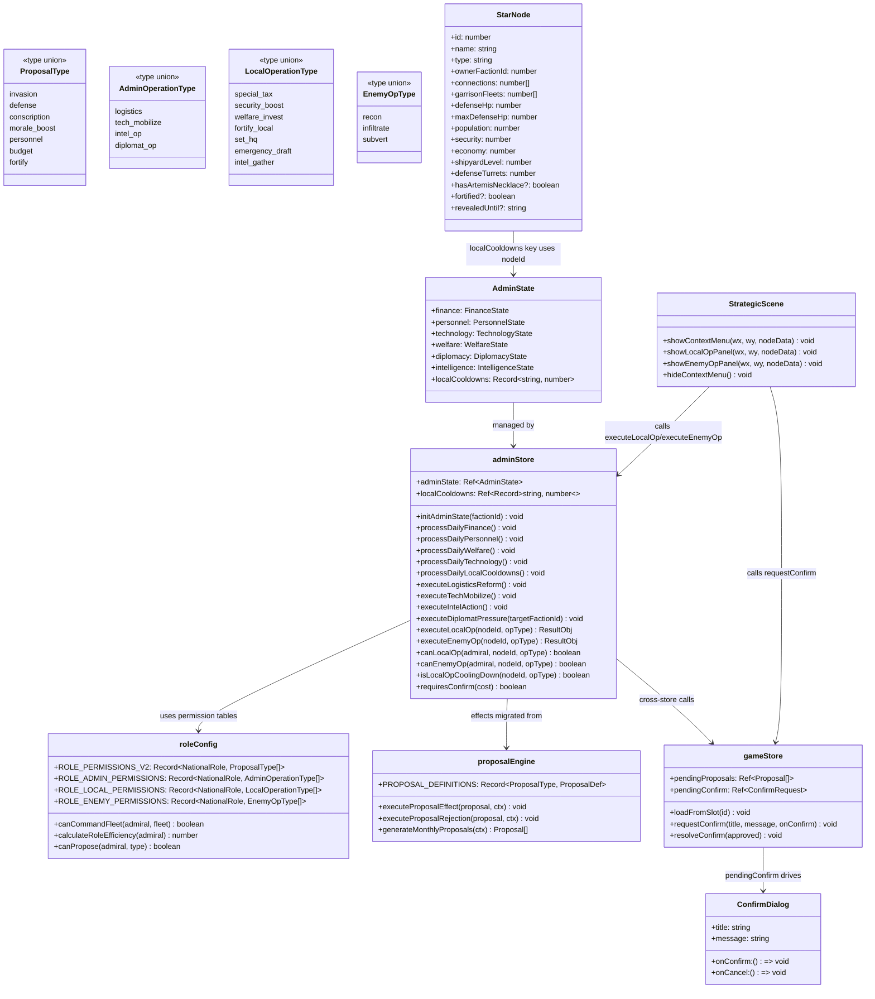
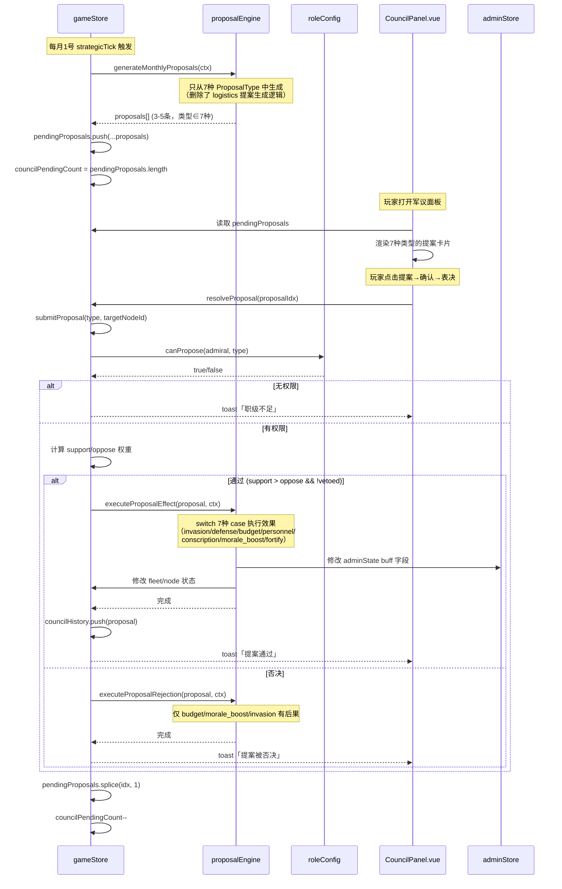
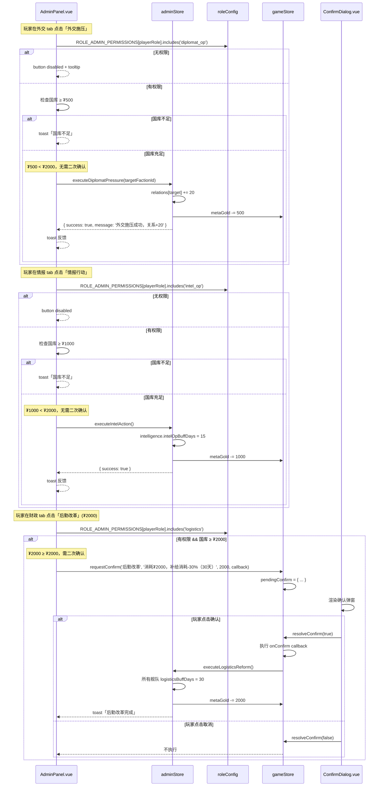
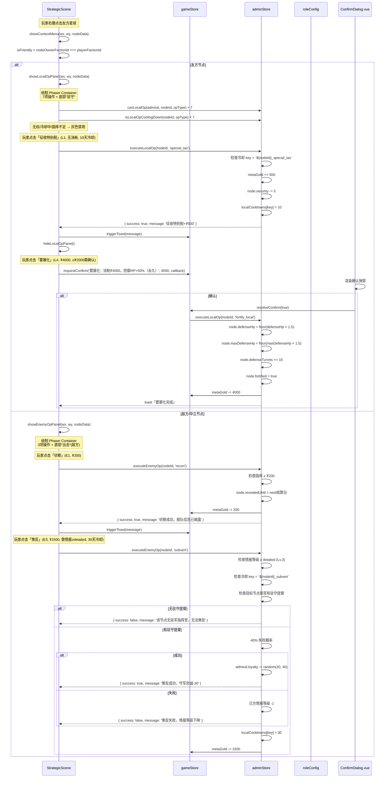
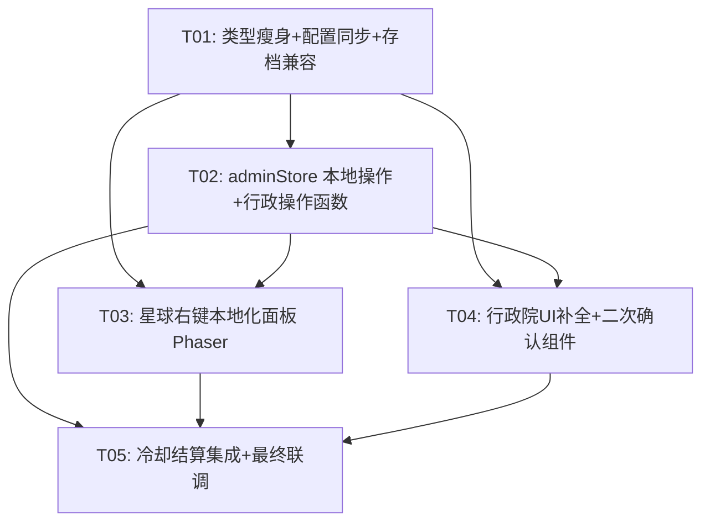

# 系统架构设计 v3：军议瘦身 + 行政院补全 + 星球右键本地化

> **项目**: 银河英雄传说 策略游戏 (hex-strategy-game)
> **技术栈**: Vue 3 + Phaser + Pinia + TypeScript
> **架构师**: Bob
> **日期**: 2025-07
> **前置文档**: `PRD_军议瘦身_行政院补全_星球本地化.md`、`system_design.md`（第二轮 SOP）

---

## Part A: System Design

## 1. 实现方案

### 1.1 总体改造策略

本轮是第三轮增量开发，在第二轮已建好的军议引擎 + 行政 Store + 权限配置基础上进行**瘦身 + 补全 + 本地化**三项联动改造：

| 方向 | 策略 | 风险等级 |
|------|------|---------|
| 军议瘦身 | 从 `ProposalType` 12 种删减为 7 种（删除 tax/logistics/tech_mobilize/intel_op/diplomat_op）；同步删除 `PROPOSAL_DEFINITIONS`/`POLITICAL_VOTE_COEFFICIENTS`/`ROLE_PERMISSIONS_V2` 中对应条目 | 低 |
| 行政院补全 | 将删除的 5 种中 4 种（tax 废弃）迁移为 `AdminOperationType`，在 AdminPanel.vue 外交/情报 tab 中实现完整交互，财政/科技 tab 新增按钮入口 | 中 |
| 星球本地化 | StrategicScene.ts `showContextMenu` 中将"行政(toast占位)"替换为 Phaser Container 绘制的本地化操作面板（友方7项/敌方3项）；adminStore 新增本地操作函数群 | 中 |
| 二次确认机制 | 新建 `ConfirmDialog.vue` 通用组件，≥₮2000 操作弹确认框 | 低 |
| 存档兼容 | `loadFromSlot` 过滤已删除类型的 `pendingProposals`；旧存档 `localCooldowns` 缺失时填充空对象 | 低 |

**架构决策**：
1. **不引入新框架**：沿用 Vue3 + Phaser + Pinia + TS，所有功能基于现有技术栈实现。
2. **类型层先行**：先瘦身 `ProposalType` → 7 种，同时新增 `AdminOperationType`/`LocalOperationType`/`EnemyOpType` 三组类型。类型变更同步传导到配置层和引擎层。
3. **本地操作面板用 Phaser Container 实现**：与现有 `showContextMenu` 保持一致的渲染方式（`setScale(1/zoom)` 不随地图缩放），避免引入 Vue overlay 层叠 Phaser canvas 的兼容问题。面板内容通过 Phaser Text + Graphics 绘制，交互通过 `setInteractive` 实现。
4. **二次确认用 Vue 组件实现**：`ConfirmDialog.vue` 作为全局 overlay（z-index 200），由 gameStore 的 `pendingConfirm` ref 驱动显示。行政院操作和星球本地操作均可触发。
5. **权限矩阵双表新增**：在 `roleConfig.ts` 新增 `ROLE_ADMIN_PERMISSIONS` 和 `ROLE_LOCAL_PERMISSIONS` 两张表，与现有 `ROLE_PERMISSIONS_V2` 并列。`ROLE_PERMISSIONS_V2` 瘦身为 7 种。

### 1.2 文件修改范围一览表

| 文件 | 操作 | 改动摘要 |
|------|------|---------|
| `types/game.ts` | [修改] | `ProposalType` 12→7；新增 `AdminOperationType`/`LocalOperationType`/`EnemyOpType`；`StarNode` 新增 `fortified`/`revealedUntil` 字段；`AdminState` 新增 `localCooldowns` 字段 |
| `config/tagConfig.ts` | [修改] | `POLITICAL_VOTE_COEFFICIENTS` 12列→7列；`ROLE_VOTE_INFLUENCE` 删除已移除类型条目 |
| `config/roleConfig.ts` | [修改] | `ROLE_PERMISSIONS_V2` 各角色 ProposalType[] 删5种；新增 `ROLE_ADMIN_PERMISSIONS`/`ROLE_LOCAL_PERMISSIONS` 两张权限表 |
| `utils/proposalEngine.ts` | [修改] | `PROPOSAL_DEFINITIONS` 12→7；`executeProposalEffect` 删5 case；`generateMonthlyProposals` 只生成7种 |
| `store/adminStore.ts` | [修改] | 新增 `localCooldowns` ref + 本地操作函数群（executeLocalOp/executeEnemyOp/canLocalOp/canEnemyOp/isLocalOpCoolingDown/processDailyLocalCooldowns）+ 行政操作函数（executeLogisticsReform/executeTechMobilize/executeIntelAction/executeDiplomatPressure） |
| `store/gameStore.ts` | [修改] | `loadFromSlot` 过滤已删除类型 pendingProposals；新增 `pendingConfirm` ref + `requestConfirm`/`resolveConfirm` 函数 |
| `components/meta/AdminPanel.vue` | [修改] | 外交 tab 替换占位为完整交互；情报 tab 替换占位为完整交互；财政 tab 新增后勤改革按钮；科技 tab 新增科技动员按钮 |
| `components/meta/CouncilPanel.vue` | [修改] | 删除5个 `.prop-tag-*` CSS 类；提案标签映射表删5项 |
| `components/meta/ConfirmDialog.vue` | [新建] | 通用二次确认弹窗组件 |
| `game/scenes/StrategicScene.ts` | [修改] | `showContextMenu` 中友方"行政"项改为弹出本地化操作面板（7项）；敌方/中立"情报"项改为弹出情报操作面板（3项） |

### 1.3 不变的部分（硬约束）

| 系统 | 说明 |
|------|------|
| 舰队归属 | `initFleetAssignment` / `assignFleetByNovel` 不变 |
| 标签核心 | `TAG_META_MAP`、`PERSONALITY_MODIFIERS`、`MILITARY_STYLE_PARAMS` 不变，仅 `POLITICAL_VOTE_COEFFICIENTS` 列数减少 |
| 行政每日结算 | `processDailyFinance`/`processDailyPersonnel`/`processDailyWelfare`/`processDailyTechnology` 逻辑不变 |
| 职位适配度 | `calculateRoleEfficiency` 不变 |
| 舰队调动权限 | `canCommandFleet` 不变 |
| 右键"驻守"/"出击" | 原有舰队编成面板逻辑不变 |

---

## 2. 文件列表及相对路径

> 以下路径均相对于 `frontend/src/`

### 2.1 类型与配置层

| # | 文件路径 | 操作 | 改动内容 |
|---|---------|------|---------|
| 1 | `types/game.ts` | [修改] | ① `ProposalType` 从 12 种瘦身为 7 种：`'invasion' \| 'defense' \| 'conscription' \| 'morale_boost' \| 'personnel' \| 'budget' \| 'fortify'`（删除 tax/logistics/tech_mobilize/intel_op/diplomat_op）；② 新增 `AdminOperationType = 'logistics' \| 'tech_mobilize' \| 'intel_op' \| 'diplomat_op'`；③ 新增 `LocalOperationType = 'special_tax' \| 'security_boost' \| 'welfare_invest' \| 'fortify_local' \| 'set_hq' \| 'emergency_draft' \| 'intel_gather'`；④ 新增 `EnemyOpType = 'recon' \| 'infiltrate' \| 'subvert'`；⑤ `StarNode` 新增 `fortified?: boolean`、`revealedUntil?: string` 字段；⑥ `AdminState` 新增 `localCooldowns: Record<string, number>` 字段 |
| 2 | `config/tagConfig.ts` | [修改] | `POLITICAL_VOTE_COEFFICIENTS` 每个 PoliticalTag 的 Record 从 12 列删为 7 列（删除 tax/logistics/tech_mobilize/intel_op/diplomat_op 系数）；`ROLE_VOTE_INFLUENCE` 删除已移除类型的条目 |
| 3 | `config/roleConfig.ts` | [修改] | ① `ROLE_PERMISSIONS_V2` 各角色的 ProposalType[] 删除 5 种（emperor/council 从12→7，其余角色按各自权限删除对应项）；② 新增 `ROLE_ADMIN_PERMISSIONS: Record<NationalRole, AdminOperationType[]>`；③ 新增 `ROLE_LOCAL_PERMISSIONS: Record<NationalRole, LocalOperationType[]>`；④ 新增 `ROLE_ENEMY_PERMISSIONS: Record<NationalRole, EnemyOpType[]>` |

### 2.2 状态管理层

| # | 文件路径 | 操作 | 改动内容 |
|---|---------|------|---------|
| 4 | `store/adminStore.ts` | [修改] | ① 新增 `localCooldowns: Ref<Record<string, number>>` ref；② 新增行政操作函数：`executeLogisticsReform()`、`executeTechMobilize()`、`executeIntelAction()`、`executeDiplomatPressure(targetFactionId)`；③ 新增本地操作函数：`executeLocalOp(nodeId, opType)`、`executeEnemyOp(nodeId, opType)`；④ 新增权限校验函数：`canLocalOp(admiral, nodeId, opType)`、`canEnemyOp(admiral, nodeId, opType)`；⑤ 新增冷却函数：`isLocalOpCoolingDown(nodeId, opType)`、`processDailyLocalCooldowns()`；⑥ 新增二次确认检查：`requiresConfirm(cost): boolean`（≥2000 返回 true） |
| 5 | `store/gameStore.ts` | [修改] | ① `loadFromSlot` 中过滤 `pendingProposals`：删除 type 为 tax/logistics/tech_mobilize/intel_op/diplomat_op 的条目；② 新增 `pendingConfirm: Ref<{title: string, message: string, onConfirm: () => void} \| null>` ref；③ 新增 `requestConfirm(title, message, onConfirm)` 和 `resolveConfirm(approved: boolean)` 函数 |

### 2.3 工具层

| # | 文件路径 | 操作 | 改动内容 |
|---|---------|------|---------|
| 6 | `utils/proposalEngine.ts` | [修改] | ① `PROPOSAL_DEFINITIONS` 删除 5 条（tax/logistics/tech_mobilize/intel_op/diplomat_op），保留 7 条；② `executeProposalEffect` 删除 5 个 case（tax/logistics/tech_mobilize/intel_op/diplomat_op），对应效果迁移到 adminStore 的行政操作函数；③ `generateMonthlyProposals` 只从 7 种类型中生成（删除 logistics 提案生成逻辑） |

### 2.4 UI 层

| # | 文件路径 | 操作 | 改动内容 |
|---|---------|------|---------|
| 7 | `components/meta/AdminPanel.vue` | [修改] | ① 外交 tab：替换灰色占位为完整交互（阵营关系列表 + 施压按钮 + 条约区）；② 情报 tab：替换灰色占位为完整交互（情报等级面板 + 情报搜集/行动按钮 + 已揭露信息列表）；③ 财政 tab：新增"后勤改革"按钮（₮2000，二次确认）；④ 科技 tab：新增"科技动员"按钮（₮3000，二次确认）；⑤ 所有新增按钮受 `ROLE_ADMIN_PERMISSIONS` 约束 |
| 8 | `components/meta/CouncilPanel.vue` | [修改] | ① 删除 5 个 CSS 类：`.prop-tag-tax`、`.prop-tag-logistics`、`.prop-tag-tech_mobilize`、`.prop-tag-intel_op`、`.prop-tag-diplomat_op`；② 提案标签映射表（`getProposalName`/`getProposalTagClass` 等）删除 5 项 |
| 9 | `components/meta/ConfirmDialog.vue` | [新建] | 通用二次确认弹窗组件，props: `title`/`message`/`onConfirm`/`onCancel`，z-index 200，居中显示，遮罩层点击关闭 |
| 10 | `game/scenes/StrategicScene.ts` | [修改] | ① `showContextMenu` 中友方节点"行政"项改为调用 `showLocalOpPanel(wx, wy, nodeData)`；② 敌方/中立节点"情报"项改为调用 `showEnemyOpPanel(wx, wy, nodeData)`；③ 新增 `showLocalOpPanel` 方法：绘制 7 项本地操作面板（Phaser Container）；④ 新增 `showEnemyOpPanel` 方法：绘制 3 项敌方操作面板（Phaser Container）；⑤ 每项操作点击后调用 adminStore 对应函数 + toast + 关闭面板 |

---

## 3. 数据结构和接口



### 3.1 ProposalType 瘦身后定义（7 种）

```typescript
export type ProposalType =
  | 'invasion'        // 战略侵攻动员
  | 'defense'         // 星域防卫令
  | 'conscription'    // 扩大强制征兵令
  | 'morale_boost'    // 全军士气鼓舞令
  | 'personnel'       // 人事任免令
  | 'budget'          // 申请特别军费
  | 'fortify';        // 要塞强化令（战略级）
```

### 3.2 新增类型定义

```typescript
/** 行政院操作类型（从军议迁出的 4 种，tax 废弃由 warTaxRate 覆盖） */
export type AdminOperationType =
  | 'logistics'       // 后勤改革（补给消耗-30%/30天，₮2000）
  | 'tech_mobilize'   // 科技动员（研发速度×2/30天，₮3000）
  | 'intel_op'        // 情报行动（情报等级+1/15天，₮1000）
  | 'diplomat_op';    // 外交施压（关系+20，₮500）

/** 友方节点本地操作类型（7 种） */
export type LocalOperationType =
  | 'special_tax'     // L1 征收特别税（+₮500, security-5, 10天冷却）
  | 'security_boost'  // L2 强化治安（security+15, ₮300）
  | 'welfare_invest'  // L3 民生投资（economy+150, ₮800）
  | 'fortify_local'   // L4 要塞化（defenseHp×1.5, ₮4000, 永久）
  | 'set_hq'          // L5 设为防卫司令部（治安×3, 补给×2）
  | 'emergency_draft' // L6 紧急征召（兵源+5%, morale-10, 15天冷却）
  | 'intel_gather';   // L7 情报搜集（揭示相邻敌方, ₮200）

/** 敌方节点操作类型（3 种） */
export type EnemyOpType =
  | 'recon'           // E1 侦察（显示舰队数量, ₮200）
  | 'infiltrate'      // E2 渗透（持续可见15天, ₮800, 需情报≥basic）
  | 'subvert';        // E3 策反（降低守军忠诚, ₮1500, 需情报≥detailed, 30天冷却）
```

### 3.3 StarNode 字段扩展

```typescript
// 在现有 StarNode 接口中新增：
export interface StarNode {
  // ... 现有字段不变 ...

  // ===== v3 新增：本地化操作字段 =====
  fortified?: boolean;         // L4 要塞化标记（每节点仅限1次）
  revealedUntil?: string;      // E2 渗透：持续可见到期日（宇宙历），null/过期 = 未渗透
}
```

### 3.4 AdminState 扩展

```typescript
export interface AdminState {
  finance: FinanceState;
  personnel: PersonnelState;
  technology: TechnologyState;
  welfare: WelfareState;
  diplomacy: DiplomacyState;
  intelligence: IntelligenceState;
  // ===== v3 新增 =====
  localCooldowns: Record<string, number>;  // key: `${nodeId}_${opType}`, value: 剩余天数
}
```

### 3.5 权限矩阵（新增三张表）

```typescript
// config/roleConfig.ts 新增

/** 行政院操作权限矩阵 */
export const ROLE_ADMIN_PERMISSIONS: Record<NationalRole, AdminOperationType[]> = {
  emperor:               ['logistics', 'tech_mobilize', 'intel_op', 'diplomat_op'],
  council:               ['logistics', 'tech_mobilize', 'intel_op', 'diplomat_op'],
  prime_minister:        ['logistics', 'diplomat_op'],
  military_minister:     ['logistics', 'tech_mobilize'],
  intel_minister:        ['intel_op', 'diplomat_op'],
  high_command_chief:    ['intel_op'],
  joint_ops_chief:       ['intel_op'],
  space_fleet_commander: [],
  space_fleet_deputy:    [],
  defense_commander:     [],
  fleet_commander:       [],
  fleet_staff:           [],
  joint_ops_deputy:      [],
  none:                  [],
};

/** 友方节点本地操作权限矩阵 */
export const ROLE_LOCAL_PERMISSIONS: Record<NationalRole, LocalOperationType[]> = {
  emperor:               ['special_tax', 'security_boost', 'welfare_invest', 'fortify_local', 'set_hq', 'emergency_draft', 'intel_gather'],
  council:               ['special_tax', 'security_boost', 'welfare_invest', 'fortify_local', 'set_hq', 'emergency_draft', 'intel_gather'],
  prime_minister:        ['special_tax', 'welfare_invest', 'set_hq'],
  military_minister:     ['security_boost', 'fortify_local', 'emergency_draft'],
  defense_commander:     ['special_tax', 'security_boost', 'welfare_invest', 'fortify_local', 'set_hq', 'emergency_draft', 'intel_gather'], // 仅驻守节点
  intel_minister:        ['intel_gather'],
  high_command_chief:    ['emergency_draft', 'intel_gather'],
  joint_ops_chief:       ['emergency_draft', 'intel_gather'],
  space_fleet_commander: ['emergency_draft', 'intel_gather'],
  space_fleet_deputy:    ['emergency_draft', 'intel_gather'],
  fleet_commander:       ['security_boost', 'emergency_draft'], // 仅驻守节点
  fleet_staff:           [],
  joint_ops_deputy:      ['emergency_draft', 'intel_gather'],
  none:                  [],
};

/** 敌方节点操作权限矩阵 */
export const ROLE_ENEMY_PERMISSIONS: Record<NationalRole, EnemyOpType[]> = {
  emperor:               ['recon', 'infiltrate', 'subvert'],
  council:               ['recon', 'infiltrate', 'subvert'],
  prime_minister:        ['recon'],
  military_minister:     ['recon'],
  intel_minister:        ['recon', 'infiltrate', 'subvert'],
  high_command_chief:    ['recon', 'infiltrate'],
  joint_ops_chief:       ['recon', 'infiltrate'],
  space_fleet_commander: ['recon'],
  space_fleet_deputy:    ['recon'],
  defense_commander:     ['recon'], // 仅相邻节点
  fleet_commander:       [],
  fleet_staff:           [],
  joint_ops_deputy:      [],
  none:                  [],
};
```

### 3.6 adminStore 新增函数签名

```typescript
// store/adminStore.ts 新增

/** 本地操作冷却 key 命名规范：`${nodeId}_${opType}` */
function getCooldownKey(nodeId: number, opType: string): string;

/** 执行友方节点本地操作 */
function executeLocalOp(nodeId: number, opType: LocalOperationType): { success: boolean; message: string };

/** 执行敌方/中立节点情报操作 */
function executeEnemyOp(nodeId: number, opType: EnemyOpType): { success: boolean; message: string };

/** 检查本地操作权限（含 defense_commander 驻守节点限制） */
function canLocalOp(admiral: BaseAdmiral, nodeId: number, opType: LocalOperationType): boolean;

/** 检查敌方操作权限（含 defense_commander 相邻节点限制） */
function canEnemyOp(admiral: BaseAdmiral, nodeId: number, opType: EnemyOpType): boolean;

/** 本地操作冷却检查 */
function isLocalOpCoolingDown(nodeId: number, opType: string): boolean;

/** 每日结算：递减冷却计数器 */
function processDailyLocalCooldowns(): void;

/** 行政操作：后勤改革 */
function executeLogisticsReform(): void;

/** 行政操作：科技动员 */
function executeTechMobilize(): void;

/** 行政操作：情报行动 */
function executeIntelAction(): void;

/** 行政操作：外交施压 */
function executeDiplomatPressure(targetFactionId: number): void;

/** 二次确认判断（≥₮2000 需确认） */
function requiresConfirm(cost: number): boolean;
```

### 3.7 二次确认数据结构

```typescript
// store/gameStore.ts 新增

interface ConfirmRequest {
  title: string;
  message: string;
  cost: number;
  onConfirm: () => void;
}

const pendingConfirm = ref<ConfirmRequest | null>(null);

function requestConfirm(title: string, message: string, cost: number, onConfirm: () => void): void;
function resolveConfirm(approved: boolean): void;
```

---

## 4. 程序调用流程

### 4.1 军议瘦身后提案生成→表决→执行流程



### 4.2 行政院外交/情报 tab 操作流程（含权限校验+二次确认）



### 4.3 星球右键本地化操作流程（友方7项/敌方3项）



---

## 5. 任务列表

> 按依赖顺序排列，每个任务包含 ID、标题、文件、依赖、优先级、改动要点和验收标准。

### T01: 类型瘦身 + 配置同步 + 存档兼容

**源文件**：
- `types/game.ts` [修改]
- `config/tagConfig.ts` [修改]
- `config/roleConfig.ts` [修改]
- `utils/proposalEngine.ts` [修改]
- `store/gameStore.ts` [修改]

**依赖**：无

**优先级**：P0

**改动要点**：
1. `types/game.ts`：
   - `ProposalType` 从 12 种瘦身为 7 种（删除 `tax`/`logistics`/`tech_mobilize`/`intel_op`/`diplomat_op`）
   - 新增 `AdminOperationType`、`LocalOperationType`、`EnemyOpType` 三个联合类型
   - `StarNode` 新增 `fortified?: boolean` 和 `revealedUntil?: string` 字段
   - `AdminState` 新增 `localCooldowns: Record<string, number>` 字段
2. `config/tagConfig.ts`：
   - `POLITICAL_VOTE_COEFFICIENTS` 每个 PoliticalTag 的 Record 从 12 列删为 7 列
   - `ROLE_VOTE_INFLUENCE` 删除已移除类型的条目
3. `config/roleConfig.ts`：
   - `ROLE_PERMISSIONS_V2` 各角色 ProposalType[] 删除 5 种（emperor/council 从 12→7）
   - 新增 `ROLE_ADMIN_PERMISSIONS`、`ROLE_LOCAL_PERMISSIONS`、`ROLE_ENEMY_PERMISSIONS` 三张权限表
4. `utils/proposalEngine.ts`：
   - `PROPOSAL_DEFINITIONS` 删除 5 条定义，保留 7 条
   - `executeProposalEffect` 删除 5 个 case
   - `executeProposalRejection` 不变（仅 budget/morale_boost/invasion 有后果）
   - `generateMonthlyProposals` 删除 logistics 提案生成逻辑，只从 7 种中生成
5. `store/gameStore.ts`：
   - `loadFromSlot` 中过滤 `pendingProposals`：`data.pendingProposals?.filter(p => !['tax','logistics','tech_mobilize','intel_op','diplomat_op'].includes(p.type))`
   - 新增 `pendingConfirm` ref + `requestConfirm`/`resolveConfirm` 函数

**验收标准**：
- [x] `ProposalType` 类型只有 7 种，TS 编译无报错
- [x] `POLITICAL_VOTE_COEFFICIENTS` 每个 PoliticalTag 的 Record 只有 7 个 key
- [x] `ROLE_PERMISSIONS_V2` 各角色的 ProposalType[] 不包含已删除的 5 种
- [x] `PROPOSAL_DEFINITIONS` 只有 7 条定义
- [x] 旧存档加载时，pendingProposals 中已删除类型的提案被过滤
- [x] `npm run build` 无 TS 类型错误

---

### T02: adminStore 本地操作函数群 + 行政操作函数

**源文件**：
- `store/adminStore.ts` [修改]
- `types/game.ts` [修改 — 确认 AdminState.localCooldowns]

**依赖**：T01

**优先级**：P0

**改动要点**：
1. 新增 `localCooldowns: Ref<Record<string, number>>` ref，初始值 `{}`
2. 新增 `getCooldownKey(nodeId, opType): string` → 返回 `${nodeId}_${opType}`
3. 新增 `processDailyLocalCooldowns()`：遍历 localCooldowns，递减 >0 的值，删除 ≤0 的 key
4. 新增 `executeLocalOp(nodeId, opType)` 实现 7 种友方操作：
   - L1 special_tax：metaGold += 500，node.security -= 5，cooldown = 10
   - L2 security_boost：metaGold -= 300，node.security += 15
   - L3 welfare_invest：metaGold -= 800，node.economy += 150
   - L4 fortify_local：metaGold -= 4000，node.defenseHp = floor(×1.5)，node.maxDefenseHp = floor(×1.5)，node.defenseTurrets += 10，node.fortified = true
   - L5 set_hq：查找 defense_commander 提督，设置 assignedNodeId = nodeId
   - L6 emergency_draft：node 所属舰队兵源+5%，morale -= 10，cooldown = 15
   - L7 intel_gather：metaGold -= 200，揭示相邻敌方节点（设置 revealedUntil = next结算日）
5. 新增 `executeEnemyOp(nodeId, opType)` 实现 3 种敌方操作：
   - E1 recon：metaGold -= 200，node.revealedUntil = next结算日
   - E2 infiltrate：metaGold -= 800，检查情报等级 ≥ basic，node.revealedUntil = currentDay + 15
   - E3 subvert：metaGold -= 1500，检查情报等级 ≥ detailed，检查有驻守提督，40% 失败概率，成功 loyalty -= random(20,40)，失败己方情报-1，cooldown = 30
6. 新增 `canLocalOp(admiral, nodeId, opType)`：检查 `ROLE_LOCAL_PERMISSIONS[role].includes(opType)`；defense_commander 额外检查 `admiral.assignedNodeId === nodeId`；fleet_commander 额外检查驻守节点
7. 新增 `canEnemyOp(admiral, nodeId, opType)`：检查 `ROLE_ENEMY_PERMISSIONS[role].includes(opType)`；defense_commander 额外检查相邻节点
8. 新增 `isLocalOpCoolingDown(nodeId, opType)`：检查 `localCooldowns[key] > 0`
9. 新增 `requiresConfirm(cost)`：`return cost >= 2000`
10. 新增行政操作函数（从 proposalEngine 迁移的效果）：
    - `executeLogisticsReform()`：所有己方舰队 logisticsBuffDays = 30，metaGold -= 2000
    - `executeTechMobilize()`：techMobilizeBuffDays = 30，metaGold -= 3000
    - `executeIntelAction()`：intelOpBuffDays = 15，metaGold -= 1000
    - `executeDiplomatPressure(targetFactionId)`：relations[target] += 20，metaGold -= 500
11. 在 `createDefaultAdminState()` 中初始化 `localCooldowns: {}`

**验收标准**：
- [x] `executeLocalOp` 7 种操作均可正确执行并返回 `{ success, message }`
- [x] `executeEnemyOp` 3 种操作均可正确执行，权限/情报等级/冷却校验生效
- [x] `canLocalOp`/`canEnemyOp` 正确返回权限判断结果
- [x] `isLocalOpCoolingDown` 正确检查冷却状态
- [x] `processDailyLocalCooldowns` 正确递减冷却计数器
- [x] 行政操作函数正确扣费和设置 buff
- [x] `requiresConfirm(1999)` = false，`requiresConfirm(2000)` = true

---

### T03: 星球右键本地化操作面板（Phaser）

**源文件**：
- `game/scenes/StrategicScene.ts` [修改]

**依赖**：T01, T02

**优先级**：P0

**改动要点**：
1. 修改 `showContextMenu` 方法：
   - 友方节点：将"行政"项改为调用 `showLocalOpPanel(wx, wy, nodeData)`，保留"驻守"项不变
   - 敌方节点：将"情报"项改为调用 `showEnemyOpPanel(wx, wy, nodeData)`，保留"出击"项不变
   - 中立节点：将"情报"项改为调用 `showEnemyOpPanel(wx, wy, nodeData)`
2. 新增 `showLocalOpPanel(wx, wy, nodeData)` 方法：
   - 创建 Phaser Container（`setScale(1/zoom)`，与现有 contextMenu 一致）
   - 面板宽度 220px，8 行（7项操作 + 1项驻守）
   - 每行：左侧色点 + 操作名称 + 效果摘要 + 消耗
   - 对每项操作调用 `canLocalOp` + `isLocalOpCoolingDown` + 国库检查，无权/冷却中/国库不足 → 灰色禁用
   - 点击有效项 → 若 `requiresConfirm(cost)` 则调用 `gameStore.requestConfirm`，否则直接调用 `adminStore.executeLocalOp`
   - 执行后 `triggerToast` + `hideLocalOpPanel()`
3. 新增 `showEnemyOpPanel(wx, wy, nodeData)` 方法：
   - 面板宽度 220px，4 行（3项操作 + 1项出击/无）
   - 对每项操作调用 `canEnemyOp` + 情报等级检查 + 国库检查
   - 点击有效项 → 同上确认逻辑 → 调用 `adminStore.executeEnemyOp`
4. 新增 `hideLocalOpPanel()` / `hideEnemyOpPanel()` 方法：销毁 Container
5. 色点配色：经济=绿(`0x22c55e`)、军事=红(`0xef4444`)、民生=蓝(`0x3b82f6`)、情报=黄(`0xfbbf24`)

**验收标准**：
- [x] 右键友方星球弹出 7 项操作面板 + 驻守
- [x] 右键敌方星球弹出 3 项操作面板 + 出击
- [x] 无权限/冷却中/国库不足的项目灰色禁用
- [x] 点击操作后正确执行效果 + toast + 关闭面板
- [x] ≥₮2000 操作弹出二次确认框
- [x] 面板不随地图缩放（`setScale(1/zoom)`）
- [x] 驻守/出击功能不受影响

---

### T04: 行政院 UI 补全（外交+情报+财政+科技按钮）+ 二次确认组件

**源文件**：
- `components/meta/AdminPanel.vue` [修改]
- `components/meta/ConfirmDialog.vue` [新建]
- `components/meta/CouncilPanel.vue` [修改]
- `App.vue` [修改]

**依赖**：T01, T02

**优先级**：P0

**改动要点**：
1. `ConfirmDialog.vue` [新建]：
   - Props: `title: string`、`message: string`、`cost: number`
   - Emits: `confirm`、`cancel`
   - 全屏遮罩（z-index 200），居中弹窗，拟态风格
   - 显示操作名称、消耗金额、效果说明
   - 确认/取消两个按钮
2. `AdminPanel.vue` 外交 tab [修改]：
   - 替换灰色占位为完整交互
   - 阵营关系列表：每行显示阵营名 + 关系值色条（-100红 ~ +100绿）+ 施压按钮
   - 外交行动区：外交施压按钮（₮500，受 `ROLE_ADMIN_PERMISSIONS` 约束）
   - 当前条约区：列出 `diplomacy.treaties` 数组
3. `AdminPanel.vue` 情报 tab [修改]：
   - 替换灰色占位为完整交互
   - 情报等级面板：每个阵营一行，显示 IntelLevel + 进度条（4段）
   - 情报行动区：情报搜集按钮（₮200）、情报行动按钮（₮1000）
   - 已揭露信息列表：从 `intelligence.revealedFleets` 渲染
   - 活跃 Buff 区：情报行动 buff 剩余天数
4. `AdminPanel.vue` 财政 tab [修改]：
   - 新增"后勤改革"按钮（₮2000，二次确认，受权限约束）
5. `AdminPanel.vue` 科技 tab [修改]：
   - 新增"科技动员"按钮（₮3000，二次确认，受权限约束）
6. `CouncilPanel.vue` [修改]：
   - 删除 5 个 CSS 类：`.prop-tag-tax`、`.prop-tag-logistics`、`.prop-tag-tech_mobilize`、`.prop-tag-intel_op`、`.prop-tag-diplomat_op`
   - 提案标签映射表删除 5 项
7. `App.vue` [修改]：
   - 挂载 `ConfirmDialog` 组件，由 `gameStore.pendingConfirm` 驱动显示

**验收标准**：
- [x] 外交 tab 显示阵营关系列表 + 施压按钮 + 条约区
- [x] 情报 tab 显示情报等级 + 行动按钮 + 已揭露信息
- [x] 财政 tab 有后勤改革按钮
- [x] 科技 tab 有科技动员按钮
- [x] 所有新增按钮受权限约束，无权时 disabled + tooltip
- [x] ≥₮2000 操作弹出 ConfirmDialog
- [x] CouncilPanel 不再显示已删除的 5 种提案标签
- [x] ConfirmDialog 确认后执行操作，取消后不执行

---

### T05: 冷却结算集成 + 最终联调

**源文件**：
- `store/gameStore.ts` [修改]
- `store/adminStore.ts` [修改]
- `game/scenes/StrategicScene.ts` [修改]

**依赖**：T01, T02, T03, T04

**优先级**：P1

**改动要点**：
1. `gameStore.ts` `strategicTick` 每日结算：
   - 在 `evaluateRandomEvents` 调用 adminStore 每日结算的位置，追加调用 `processDailyLocalCooldowns()`
2. `adminStore.ts`：
   - 确认 `processDailyLocalCooldowns` 在 `strategicTick` 每日结算流程中被调用
   - 确认 `localCooldowns` 在存档/读档时正确序列化/反序列化
3. `StrategicScene.ts`：
   - 主题切换时关闭已打开的本地操作面板（与现有 `hideContextMenu` 一致）
   - 确认面板 z-index 高于地图但低于 Vue overlay
4. 存档兼容验证：
   - `loadFromSlot` 中 `localCooldowns` 缺失时填充 `{}`
   - `StarNode.fortified` 缺失时填充 `false`
   - `StarNode.revealedUntil` 缺失时填充 `undefined`

**验收标准**：
- [x] 每日结算时 localCooldowns 正确递减
- [x] 征收特别税 10 天后可再次执行
- [x] 紧急征召 15 天后可再次执行
- [x] 策反 30 天后可再次执行
- [x] 旧存档加载无报错，已删除类型提案被过滤
- [x] 主题切换后面板正确关闭
- [x] 存档/读档后 localCooldowns 状态保持

---

## 6. 依赖包列表

本轮**无新增第三方依赖**。所有功能基于现有技术栈实现：
- Vue 3 Composition API（`<script setup>`）
- Pinia（跨 store 调用）
- TypeScript（类型安全）
- Phaser 3（Container/Graphics/Text 绘制本地操作面板）
- 现有 CSS 变量体系（`var(--neo-body)` 等）

---

## 7. 共享知识（跨文件约定）

### 7.1 ProposalType 瘦身后同步约定

瘦身后 `ProposalType` 只有 7 种。以下文件中的 `ProposalType` 引用必须同步更新：

| 文件 | 同步内容 |
|------|---------|
| `config/tagConfig.ts` | `POLITICAL_VOTE_COEFFICIENTS` 的 `Record<ProposalType, number>` 自动变为 7 个 key；`ROLE_VOTE_INFLUENCE` 中已删除类型的条目需手动删除 |
| `config/roleConfig.ts` | `ROLE_PERMISSIONS_V2` 各角色的 `ProposalType[]` 需手动删除 5 种；`canPropose` 函数自动适配 |
| `utils/proposalEngine.ts` | `PROPOSAL_DEFINITIONS: Record<ProposalType, ProposalDef>` 自动变为 7 条；`executeProposalEffect` switch 需手动删除 5 个 case；`generateMonthlyProposals` 需手动删除 logistics 生成逻辑 |
| `components/meta/CouncilPanel.vue` | 提案标签映射表（`getProposalName`/`getProposalTagClass`）需手动删除 5 项；5 个 CSS 类需手动删除 |

**约定**：`AdminOperationType` 的 4 种类型值（`logistics`/`tech_mobilize`/`intel_op`/`diplomat_op`）与原 `ProposalType` 中的值相同，但它们是**不同的类型**。行政操作不再走提案表决流程，而是直接执行。

### 7.2 本地操作冷却 key 命名规范

```
key 格式: `${nodeId}_${opType}`
示例:
  "3_special_tax"     → 节点3的征收特别税冷却
  "7_emergency_draft" → 节点7的紧急征召冷却
  "12_subvert"        → 节点12的策反冷却
```

- key 存储在 `adminStore.localCooldowns: Record<string, number>`
- value 为剩余天数（整数），每日结算时 `processDailyLocalCooldowns` 递减
- value ≤ 0 时删除 key
- 仅 3 种操作有冷却：`special_tax`(10天)、`emergency_draft`(15天)、`subvert`(30天)

### 7.3 二次确认弹窗统一约定

- **触发条件**：操作消耗 ≥ ₮2000
- **涉及操作**：后勤改革(₮2000)、科技动员(₮3000)、要塞化(₮4000)
- **组件**：`ConfirmDialog.vue`（z-index 200，全局唯一）
- **数据驱动**：`gameStore.pendingConfirm: Ref<ConfirmRequest | null>`
- **调用方式**：
  ```typescript
  // 在任何需要二次确认的地方
  gameStore.requestConfirm('操作名称', '消耗₮XXXX，效果说明', cost, () => {
    // 确认后执行的回调
    adminStore.executeXxx();
  });
  ```
- **< ₮2000 的操作**：直接执行 + toast 反馈，不弹确认框

### 7.4 StarNode 字段扩展约定

| 新增字段 | 类型 | 默认值 | 说明 |
|---------|------|--------|------|
| `fortified` | `boolean?` | `false` | L4 要塞化标记，每节点仅限 1 次。true 时不可再次要塞化 |
| `revealedUntil` | `string?` | `undefined` | E1/E2 侦察/渗透到期日（宇宙历）。值为 `undefined` 或已过期 = 未揭露。每日结算时检查是否过期 |

**存档兼容**：旧存档的 StarNode 无这两个字段，`loadFromSlot` 时：
- `fortified` 缺失 → 默认 `false`
- `revealedUntil` 缺失 → 默认 `undefined`（即未揭露）

### 7.5 权限校验统一入口

| 操作类型 | 校验函数 | 权限表 |
|---------|---------|--------|
| 军议提案 | `canPropose(admiral, type)` | `ROLE_PERMISSIONS_V2` |
| 行政院操作 | `ROLE_ADMIN_PERMISSIONS[role].includes(opType)` | `ROLE_ADMIN_PERMISSIONS` |
| 友方本地操作 | `canLocalOp(admiral, nodeId, opType)` | `ROLE_LOCAL_PERMISSIONS` + 驻守节点检查 |
| 敌方操作 | `canEnemyOp(admiral, nodeId, opType)` | `ROLE_ENEMY_PERMISSIONS` + 相邻节点检查 |

**特殊权限规则**：
- `defense_commander`：友方操作仅限 `assignedNodeId` 节点；敌方操作仅限相邻节点
- `fleet_commander`：友方操作仅限 `security_boost`/`emergency_draft` 且仅限驻守节点
- `emperor`/`council`：全部操作均可执行

---

## 8. 任务依赖图



**关键路径**：T01 → T02 → T03/T04（并行）→ T05
**并行说明**：T03 和 T04 可并行开发（分别依赖 T01+T02），T05 在两者完成后进行集成联调。

---

## 9. 待明确事项

### 9.1 设计过程中发现的歧义

| # | 问题 | 影响 | 当前处理 |
|---|------|------|---------|
| D-1 | **L5 设为防卫司令部的交互细节**：L5 执行时需变更 `defense_commander` 的 `assignedNodeId`，但如果当前阵营没有任命 `defense_commander`（admiralsData 中该角色 assignedNodeId 为 null），L5 是否应该提示"请先任命防卫司令官"？ | 影响 L5 的前置校验 | 当前设计：L5 执行时查找 role === 'defense_commander' 的提督，若不存在则返回 `{ success: false, message: '尚未任命防卫司令官' }` |
| D-2 | **L7 情报搜集 vs E1 侦察的效果重叠**：L7 揭示相邻敌方节点的兵力级别（basic），E1 揭示目标节点的详细舰队数量（detailed）。两者都设置 `revealedUntil`，但信息粒度不同。UI 层如何区分显示？ | 影响 StrategicScene 中敌方节点信息渲染 | 当前设计：`revealedUntil` 记录到期日，信息粒度由情报等级 `IntelLevel` 决定而非 `revealedUntil`。L7 临时提升相邻节点的可见度到 basic 级，E1 临时提升目标节点到 detailed 级。建议后续在 StarNode 上新增 `tempIntelLevel` 字段区分 |
| D-3 | **外交施压的目标阵营选择 UI**：PRD 5.2 节提到"点击后弹出目标选择（若多个阵营）"。当前 AdminPanel 外交 tab 中施压按钮如何弹出阵营选择？ | 影响 AdminPanel 外交 tab 交互 | 当前设计：外交 tab 已有阵营关系列表，每行有独立施压按钮，直接对该行阵营施压，无需额外弹窗 |
| D-4 | **generateMonthlyProposals 删除 logistics 后的提案生成策略**：原逻辑中 `avgSupply < 40` 会生成 logistics 提案。删除后，低补给局势下不再有对应提案，是否需要替换为其他提案？ | 影响 月度提案生成 | 当前设计：删除 logistics 生成逻辑。低补给局势下不再自动生成提案，玩家可通过行政院"后勤改革"按钮手动处理 |
| D-5 | **本地操作面板的关闭时机**：面板弹出后，点击面板外区域是否关闭？点击另一星球右键是否切换面板？ | 影响 StrategicScene 交互 | 当前设计：与现有 contextMenu 一致——点击面板外区域关闭面板，点击另一星球右键先关闭当前面板再弹出新面板 |

### 9.2 架构风险

| # | 风险 | 影响 | 缓解方案 |
|---|------|------|---------|
| R-1 | `ProposalType` 瘦身是破坏性变更，所有引用该类型的代码都需要同步修改 | 中 | T01 集中处理所有类型/配置/引擎的同步修改，确保 TS 编译通过 |
| R-2 | Phaser Container 绘制本地操作面板的交互体验可能不如 Vue 组件 | 低 | 面板内容简单（文本+按钮），Phaser 足够。如后续需复杂表单可改为 Vue overlay |
| R-3 | `localCooldowns` 的存档序列化需要与 adminState 一起保存 | 低 | 在 `saveToSlot` 中将 `adminState.localCooldowns` 一并序列化；`loadFromSlot` 时防御性填充 `{} |
| R-4 | 二次确认弹窗（Vue z-index 200）与 Phaser Canvas 的层叠可能在某些浏览器上有渲染问题 | 低 | ConfirmDialog 使用 `position: fixed` + 不透明遮罩，确保在 Phaser Canvas 之上 |
